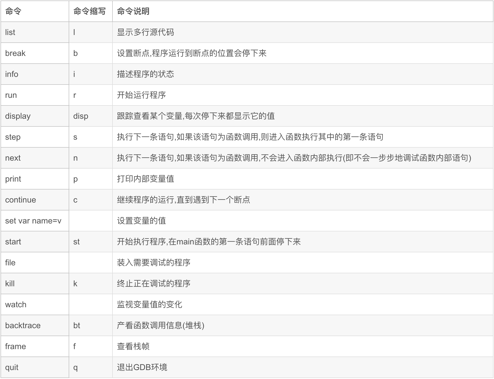

# gdb调试跟踪    
一、命令介绍    
    
    
1、设置断点(b)    
break 函数名    
break 行号    
break 文件名:函数名    
break 文件名:行号    
break +偏移量    
break -偏移量    
break *地址    
break可简写成b    
    
2、查看断点(i b)    
info break    
可简写成i b    
    
3、删除断点(d ..)    
delete <断点id>：删除指定断点    
delete：删除所有断点    
clear    
clear 函数名    
clear 行号    
clear 文件名：行号    
clear 文件名：函数名    
    
4、断点添加条件    
break 断点 if 条件；比如break sum if value==9，当输入的value为9的时候才会断住。    
condition 断点编号：给指定断点删除触发条件    
condition 断点编号 条件：给指定断点添加触发条件    
    
5、断点通过disable/enable临时停用启用    
disable    
disable 断点编号    
disable display 显示编号    
disable mem 内存区域    
enable    
enable 断点编号    
enable once 断点编号：该断点只启用一次，程序运行到该断点并暂停后，该断点即被禁用。    
enable delete 断点编号    
enable display 显示编号    
enable mem 内存区域    
    
6、运行(r)    
run运行，如有参数则跟在run命令后，如run 9    
如果需要断点在main处，则直接start即可    
    
7、显示栈帧、局部变量(bt)    
通过bt可以显示栈帧，bt full可以显示局部变量。    
bt    
bt full：不仅显示backtrace，还显示局部变量    
bt N：显示开头N个栈帧    
bt full N    
    
8、单步执行(n|s)    
单步执行有两个命令next和step，两者的区别是next遇到函数不会进入函数内部，step会执行到函数内部    
如果需要逐条汇编指令执行，可以分别使用nexti和stepi。    
    
9、继续执行(c)    
 调试时，使用continue命令继续执行程序。程序遇到断电后再次暂停执行；如果没有断点，就会一直执行到结束。    
continue：继续执行    
continue 次数：继续执行一定次数    
要想找到变量在何处被改变，可以使用watch命令设置监视点watchpoint。    
watch <表达式>：表达式发生变化时暂停运行    
awatch <表达式>：表达式被访问、改变是暂停执行    
rwatch <表达式>：表达式被访问时暂停执行    
    
10、监视点(w)    
要想找到变量在何处被改变，可以使用watch命令设置监视点watchpoint。    
watch <表达式>：表达式发生变化时暂停运行    
awatch <表达式>：表达式被访问、改变是暂停执行    
rwatch <表达式>：表达式被访问时暂停执行    
    
11、生成内核转储文件    
通过“generate-core-file”生成core.xxxx转储文件。    
然后gdb ./main ./core.xxxx查看恢复的现场。    
    
12、attach到进程     
    
# 二、跟踪mysqld    
1、查看mysqld进程pid  
[root@mysqldb ~]# ps -ef |grep -w mysqld |grep -v grep  
  
2、运行gdb  
[root@mysqldb ~]# gdb -p 7806  
  
3、设置断点  
# 此mysql源码sql_insert.cc的423行的函数Sql_cmd_insert::mysql_insert  
(gdb)  b Sql_cmd_insert::mysql_insert  
  
4、另起一个session2登录  
在另一个session2中登录数据库，发现无法登录，hung住了，在gdb中执行next（执行下一步代码），可以看到在socket_connection.cc源码第859行无法继续，代码大致是说要获取系统的socket，还有一些监听信息，由于太多了，直接在gdb中执行continue（到下一个可执行的代码），此时session2已经登录成功。  
在session2执行select等非insert操作一切是正常的。  
  
5、session2执行insert  
如果执行insert,则会话又被hung了。可以单步输入n结合bt，查看具体执行过程  
  
  
  