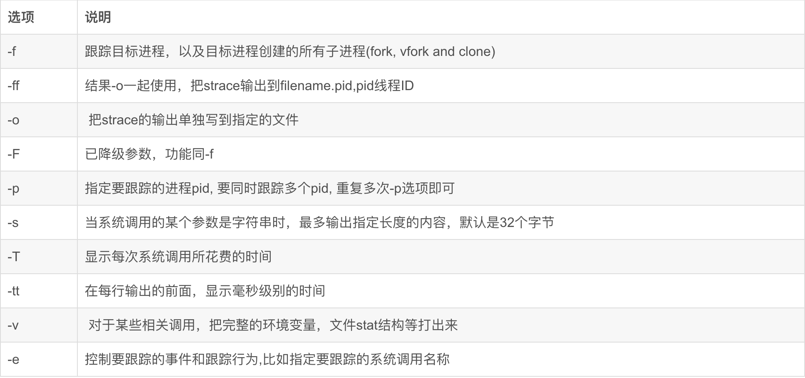

# strace  
strace常用来跟踪进程执行时的系统调用和所接收的信号。 在Linux世界，进程不能直接访问硬件设备，当进程需要访问硬件设备(比如读取磁盘文件，接收网络数据等等)时，必须由用户态模式切换至内核态模式，通过系统调用访问硬件设备。strace可以跟踪到一个进程产生的系统调用,包括参数，返回值，执行消耗的时间。  
————————————————  
strace可以跟踪正在运行的进程，或可以加执行命令进行跟踪。  
  
  
  
-e trace=file     跟踪和文件访问相关的调用(参数中有文件名)  
-e trace=process  和进程管理相关的调用，比如fork/exec/exit_group  
-e trace=network  和网络通信相关的调用，比如socket/sendto/connect  
-e trace=signal    信号发送和处理相关，比如kill/sigaction  
-e trace=desc  和文件描述符相关，比如write/read/select/epoll等  
-e trace=ipc 进程见同学相关，比如shmget等  
————————————————  
  
跟踪nginx访问了哪些文件  
strace -tt -T -f -e trace=file -o /data/log/strace.log -s 1024 ./nginx  
  
MySQL查看执行语句  
mysqld_pid=4027  
strace -f -F -ff -o mysqld-strace -s 1024 -p $mysqld_pid  #此会每个线程生成一个文件，文件名后缀为OS Thread ID.  
ls mysqld-strace.* |xargs grep -ni "select"  